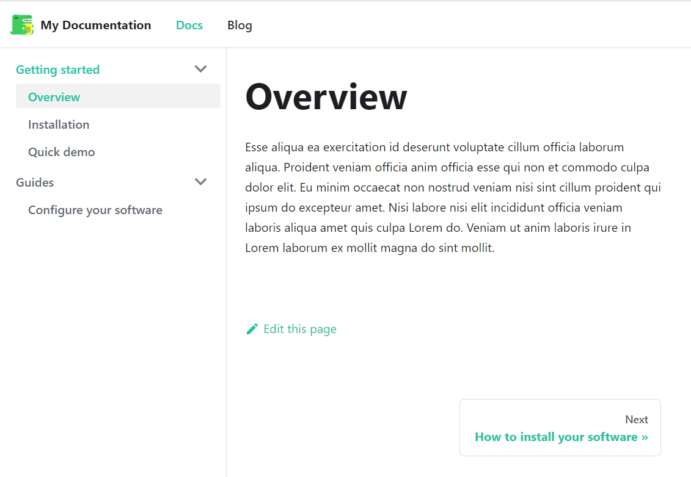
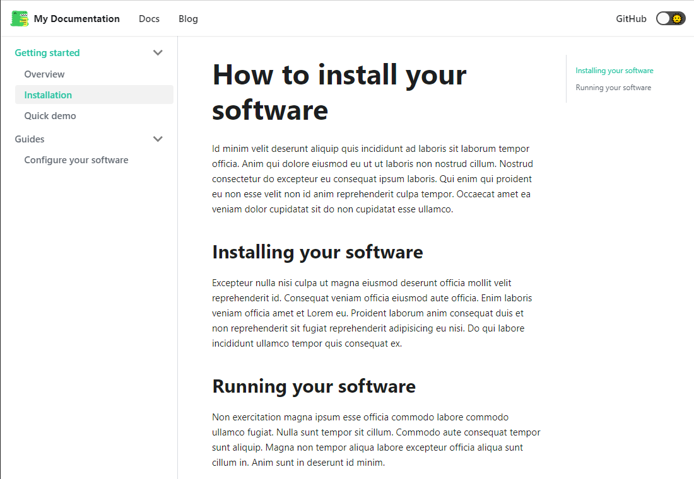

<!-- @part src="../../website-parts/quick-skelo-demo/h1-quick-skelo-demo-description.md" -->

Ullamco do magna amet reprehenderit enim consequat Lorem sit officia cupidatat et labore ex. Non ut sunt ut incididunt Lorem veniam incididunt laboris. Exercitation sint incididunt ipsum aliqua consequat quis do cillum ipsum in et. Ea dolore amet cupidatat do velit voluptate ad commodo labore. Irure eu dolor ullamco exercitation dolore et aute cillum minim incididunt excepteur exercitation magna sunt.
<!-- @/part -->

<!-- @part src="../../website-parts/quick-skelo-demo/h1-quick-skelo-demo-body.md" -->
<!-- Your content goes here, replacing this comment -->

## Step 1: Create working folder and scaffold Docusaurus v2 project

```bash
mkdir my-project
cd my-project
npx @docusaurus/init@latest init website classic
```

- Create `my-project` folder and `cd` into it.
- Use `npx` to scaffold a Docusaurus v2 project. It creates `website` documentation project using the `classic` preset.

:::info More of npx-ing Docusaurus 2
Learn more about scaffolding a Docusaurus v2 project with `npx` at [Docusaurus v2 Installation](https://v2.docusaurus.io/docs/installation#scaffold-project-website).
:::

## Step 2: Create documentation outline file

Create `my-project/website-outline.md` and paste the following content:

```md title="my-project/website-outline.md"
## docs

- Getting started
    - Overview
    - Installation @t How to install your software
        - @headers
            - Installing your software
            - Running your software
    - Quick demo @s example
- Guides @f
    - Configure your software

```

## Step 3: Use skelo to generate files

In `my-project`, run `skelo build`:

```bash
skelo website-outline -w ./website -d ./website/docs -p ./website-parts
```
```
Topic file website/docs/overview.md generated.
Topic file website/docs/installation.md generated.
Topic file website/docs/example.md generated.
Topic file website/docs/guides/configure-your-software.md generated.
Sidebars file website\sidebars.js generated.
```

:::caution
Wait, what? Where is the `build` sub-command? The answer is simple: `build` sub-command is `skelo`'s default sub-command, so `skelo` will use `build` when no sub-command appears.
:::

Skelo generated several files:

* `website/docs/*.md` -- documentation source files in `.md` format, and front-matter compatible with Docusaurus v2.
* `website-parts/**.*.md` -- Markdown files containing document partial content. 
* `website/sidebars.js` -- sidebars design file that Docusaurus v2 uses to build documentation navigation.

If you are familiar with Docusarus v2, you will feel the urge to look at `website/sidebars.js`:

```js title="website/sidebars.js"
/**
* Sidebar definitions for Docusaurus v2
*/

module.exports = {
    "docs": {
        "Getting started": [
            "overview",
            "installation",
            "example"
        ],
        "Guides": [
            "guides/configure-your-software"
        ]
    }
}
```

Remember, you can get help on `build` sub-command: `skelo help build`.

## Step 4: View skeleton documentation on development server

1. Edit `website/docusaurus.config.js` to configure documentation title and `Docs` top navigation item.

Replace:

```js
  themeConfig: {
    navbar: {
      title: 'My Site',
      logo: {
        alt: 'My Site Logo',
        src: 'img/logo.svg',
      },
      items: [
        {
          to: 'docs/',
          activeBasePath: 'docs',
          label: 'Docs',
          position: 'left',
        },
```

With:

```js
  themeConfig: {
    navbar: {
      title: 'My Documentation',
      logo: {
        alt: 'My Documentation Logo',
        src: 'img/logo.svg',
      },
      items: [
        {
          to: 'docs/overview',
          label: 'Docs',
          position: 'left',
        },
```

2. Start server

```bash
cd website
npm run start
```

```
√ Client
  Compiled successfully in 8.76s

i ｢wds｣: Project is running at http://localhost:3000/
i ｢wds｣: webpack output is served from /
i ｢wds｣: Content not from webpack is served from C:\Users\ion.gireada\Documents\VSCode Development Projects\my-project\website
i ｢wds｣: 404s will fallback to /index.html
```

Your browser opens at http://localhost:3000/. Click `Docs` to view documentation.



The Overview page contains `Lorem ipsum` text. It helps you get a sense how your documentation looks.

## Topic title and headers

Click `Installation` and see a custom topic title, two headers, and `Lorem ipsum` text as defined in `my-project/website-outline.md`:



* @t following `Installation` specifies the title appearing on the outline's item documentation page.
* @headers entry followed by two indented items indicate the headers to include in `Installation` topic.
* `Lorem ipsum` text is generated automatically under title and each headers. However, there is way to include the brief description text for a topic or headers.

<!-- @/part -->

